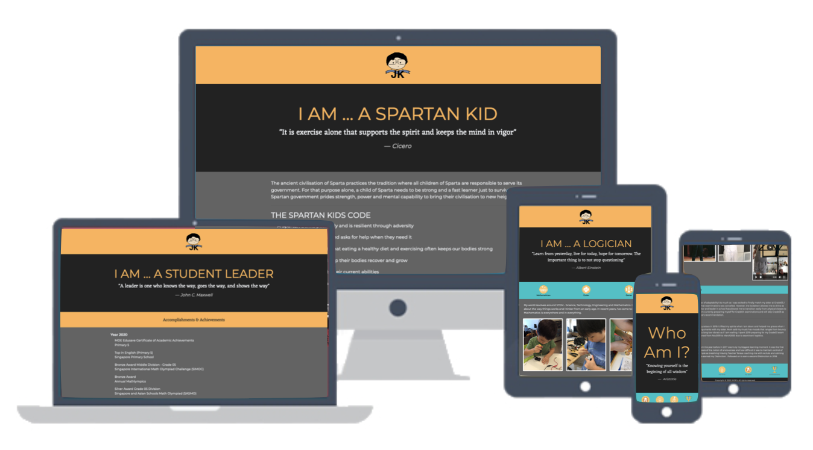
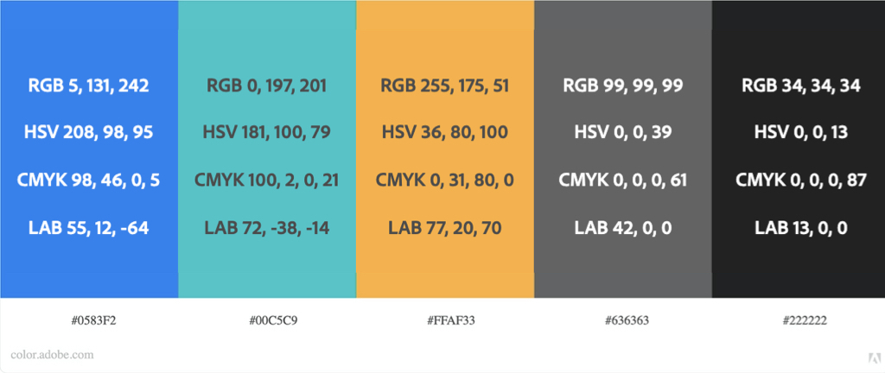

<!-- readme file explains a site's purpose, value it provides to users & deployment procedure -->
## Milestone Project 1 : User Centric Front-end Development 

### Project Purpose - Who am I?

Who am I? This is a question that plaque most individuals as we grow and adapt throughout our lifetime. It is a "major" question, especially for a child transitioning from childhood to adulthood as they test their boundaries and figure out their sense of self and identity. The aim of this project is twofold.

1. Allow JK to develop awareness of his sense of self, organize his thoughts and belief structure as he builds on his character development.

2. Organizes JK's whole child domain developments into identity groups that will provide educators and school leaders a more comprehensive picture as they consider JK for direct school admission (DSA) into secondary one. 

"Who am I?" is a project with the ultimate goal of placing JK into a secondary school that will fit his personality and the family's values. This is crucial as the teenage stage in secondary school will influence deeply and form the basis of JK's identity as he exits this transitional stage and into adulthood.

Users of this site are educators, senior teachers and school leaders who are **key decision makers** in the outcome of JK's DSA application. The information provided by JK's primary school will be limited to happenings in school and remarks by teachers who have spent time with him - to them, he is a student leader. However, a child only spends half their time at school! This site aims to provide the other side of the coin in a bid to provide key decision makers an **insight** into what drives and motivates JK's behaviour. 

## UX - User Experience

Users will land on JK's mainpage that subvertly calls them to attention with "Who am I?" and a quote by aristotle. This should ingeniously inform them that this site will let them find out more about JK. JK's developmental domains can be explored by clicking on the icon buttons; whilst scrolling down the page, educators are able to view JK's accomplishements / achievements and awards in the past 3 years.

The design of this site aims to be clean, straighforward, organized and uncluttered. The colors and typography used are a personification of JK.

Extensive use of Grey and Orange across the platform to convey a clean message of JK's personality: balance, warmth, enthusiasm, excitement and neutrality. A contrast color of turquoise adds a touch of sophistication that represents his softer side: tranquility, serenity, and wisdom.

Eczar, serif and Montserrat, san-serif were selected as font-pair that is simple and modern yet suggestive of heritage.

A demo of the site can be found here [https://whoami.jyskam.sg](https://suipingooi.github.io/jkdev/)

## Features

This site features 3 developmental domain page:
1. Physical Domain - I AM A SPARTAN KID
    * covers physical development including health and wellness; a link to strava is included that will show JK's recent workouts.
2. Cognitive Domain - I AM A LOGICIAN
    * covers his primary interest - STEM (Science, Technology, Engineering and Mathematics); a link to scratch is included.
3. Aesthetic Domain _ I AM A MUSICIAN
    * covers JK's secondary interest - music(violin)

#### Existing Features
1. Feature 1 : Icon Navigation Bar - allows users to jump to specific identity domain.
3. Feature 2 : Bottom Page Icon Navigation Bar - allows users to quickly return to specific interest segments.

#### Features Left to Implement
4. Feature 4 : A video intro (self intro video) of JK (similar to college/uni application video).
5. Feature 5 : PDF download for a summary of JK's portfolio which will include school's documentation. DSA schools require result slips of End-of-Year Examination from previous year. (current existing link is functional but will download a sample pdf instead of his portfolio pdf)
6. Feature 6 : Contact me - email form for request of references.
(current existing link opens a google form request)

## Technologies Used
1. HTML 5.0
    * For the consruction of a user centric front-end webpage
2. Bootstrap 4.0 Cascading Style Sheet
    * To simplify a flexbox grid layout structure to be responsive according to viewport sizes. 
4. Google Forms [https://fonts.google.com/](https://fonts.google.com/)
    * Support for contact-me form
5. Gimp 2.10 [https://www.gimp.org/](https://www.gimp.org/)
    * Image manipulation

## Testing

The demo link [https://whoami.jyskam.sg](https://suipingooi.github.io/jkdev/) was sent to JK's grandparents and extended family for testing outside of Singapore. This was done for the following reasons:
1. JK's grandparents have not visited since the Covid19 lockdown and this demo site allows for them to catch up on his development in the past year.
2. They are also aged with limited IT experience which allows a guage on intuitive UI/UX ability whilst on a variety of devices (ipad, iphone, samsung mobile and huawei mobile) 
3. Their location in Malaysia with possibly slower internet connection also allows a check on media capability.

Suggestions were taken into account and amendments made.

[W3C Validator](https://validator.w3.org/) testing was done for all html files. All errors corrected and suggestion for language included. 

[Jigsaw CSS Validator](https://jigsaw.w3.org/css-validator/) testing was done for css file. No error was found.

## Deployment

<!-- This section should describe the process you went through to deploy the project to a hosting platform (e.g. GitHub Pages or Heroku). -->

<!-- In particular, you should provide all details of the differences between the deployed version and the development version -->

<!-- In addition, if it is not obvious, you should also describe how to run your code locally. -->
## Credits

#### Content
1. Google Fonts
    * font-family: 'Eczar', serif;
    * font-family: 'Montserrat', sans-serif;
2. Bootstrap CSS, JS & JQuery

#### Media
1. Strava Logo retrieved from [Strava Press](blog.strava.com/press/assets) on 17 Nov 2020.
2. Scratch Logo retrieved from [Scratch](https://scratch.mit.edu/) on 18 Nov 2020.

#### Acknowledgements

JK logo designed and produced by Kaytrinh Kam.
